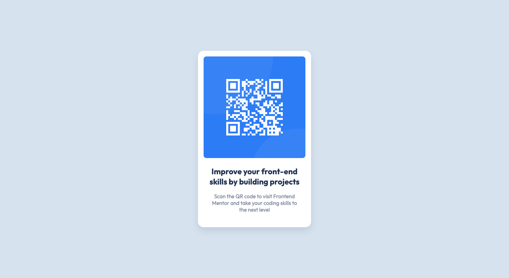
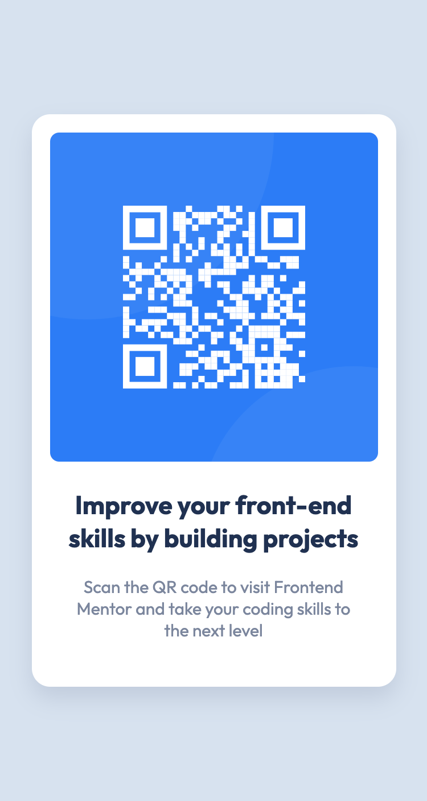

# Frontend Mentor - QR code component solution

This is a solution to the [QR code component challenge on Frontend Mentor](https://www.frontendmentor.io/challenges/qr-code-component-iux_sIO_H). Frontend Mentor challenges help you improve your coding skills by building realistic projects. 

## Table of contents

- [Overview](#overview)
  - [Screenshot](#screenshot)
  - [Links](#links)
- [My process](#my-process)
  - [Built with](#built-with)
  - [What I learned](#what-i-learned)
  - [Continued development](#continued-development)
- [Author](#author)

## Overview

The challenge is to build out a QR code component and get it looking as close to the design as possible.

Any tools can be used to complete the challenge. 
### Screenshot





### Links

- Solution URL: [Github](https://github.com/thisispeterj/frontEndMentor-QR-Code)
- Live Site URL: [Github pages demo](https://thisispeterj.github.io/frontEndMentor-QR-Code/)

## My process

I began by reviewing both the desktop and mobile designs provided to begin thinking about how I would structure the HTML. I wanted it to be as semantic as possible and efficient as possible. I then reviewed the style guide and began to add to the CSS styles sheet the provided fonts, colors, and other style attributes. 

### Built with

- Semantic HTML5 markup
- CSS custom properties
- Flexbox

### What I learned

This challenge was mainly a review of concepts and skills I have already used and put into practice on previous projects. I did however utilize css properties for the colors used in the project. For example

```css
:root {
    /* Colors */
    --White: hsl(0, 0%, 100%);
    --lightGray: hsl(212, 45%, 89%);
    --grayishBlue: hsl(220, 15%, 55%);
    --darkBlue: hsl(218, 44%, 22%);
}
```

### Continued development

I would like to continue using more CSS properties in future projects, and create more utility classes for the purpose of readability.

## Author

- Website - [thisispeterj.com](https://www.thisispeterj.com)
- Frontend Mentor - [@thisispeterj](https://www.frontendmentor.io/profile/thisispeterj)
- Linkedin - [@thisispeterj](https://www.linkedin.com/in/thisispeterj/)


